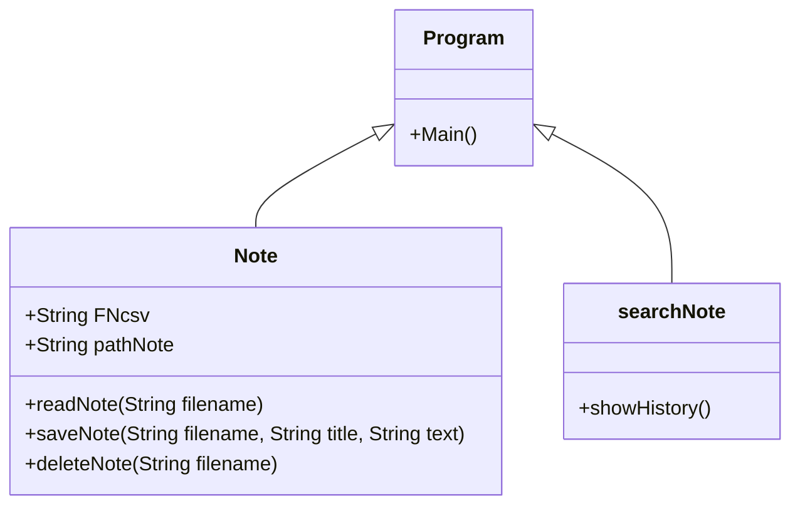

## Sticky note
### ความเป็นมาของโปรแกรม
อยากลองทำโปรแกรมจดโน๊ตขึ้นมาใช้เองบางคนก็อาจจะเคยใช้โปรแกรม sti

  
### วัตถุประสงค์ของโปรแกรม

  
### โครงสร้างของโปรแกรม

  
### ผู้พัฒนาโปรแกรม
น.ส.พรธิตา ขานพล  643450080-8                                                                                             
