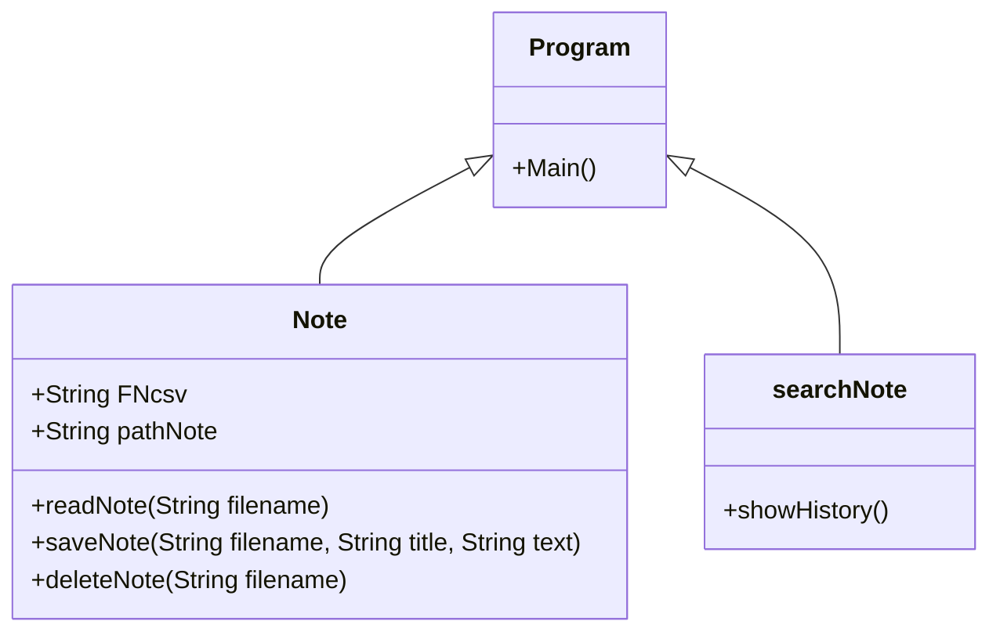

## Sticky note
### ความเป็นมาของโปรแกรม
อยากลองทำโปรแกรมจดโน๊ตขึ้นมา Sticky Note เชื่อว่าหลายคนน่าจะเคยใช้มาแล้วในแบบแอปพลิเคชันมาแล้ว แต่สิ่งที่ดิฉันทำขึ้นมานั้นเป็น Console App เพราะคอมพิวเตอร์ของดิฉันนั้นรับไม่ไหว แต่อีกสาเหตุหนึ่งที่ดิฉันทำ Sticky Note แบบ Console App ขึ้นมานั้นก็เพราะอยากลองอะไรที่แตกต่างจากที่อาจารย์สอนในคลาสอยากลองทำอะไรใหม่ๆที่ไม่เคยทำมาก่อนจึงได้ทำโปรแกรม Sticky Note แบบ Console App ขึ้นมา               

  
### วัตถุประสงค์ของโปรแกรม

  
### โครงสร้างของโปรแกรม

  
### ผู้พัฒนาโปรแกรม
น.ส.พรธิตา ขานพล  643450080-8                                                                                             
