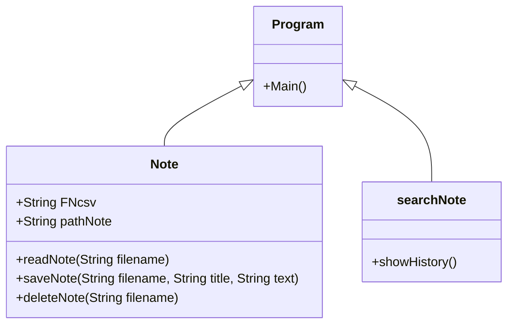

## Sticky Note
### ความเป็นมาของโปรแกรม
อยากลองทำโปรแกรมจดโน๊ตขึ้นมา Sticky Note เชื่อว่าหลายๆคนน่าจะเคยใช้ในแบบแอปพลิเคชันมาแล้ว แต่สิ่งที่ดิฉันทำขึ้นมานั้นเป็น Console App เพราะคอมพิวเตอร์ของดิฉันนัั้นไม่สามารถทำแบบ Windows Forms App ได้แต่อีกสาเหตุหนึ่งที่ดิฉันทำ Sticky Note แบบ Console App ขึ้นมานั้นก็เพราะอยากลองอะไรที่แตกต่างจากที่อาจารย์สอนในคลาสอยากลองทำอะไรใหม่ๆที่ไม่เคยทำมาก่อนจึงได้ทำโปรแกรม Sticky Note แบบ Console App ขึ้นมา               

  
### วัตถุประสงค์ของโปรแกรม
เพื่อศึกษาการใช้โปรแกรมและทดลองเขียนโปรแกรมจดโน๊ตแบบ Console App ขึ้นมาใช้เองและได้ศึกษากระบวนการทำงานของโปรแกรมนั้นเพื่อที่อนาคตอาจจะได้เอาโปรแกรมนี้ไปพัฒนาเป็นโปรแกรมของตัวเองตามที่คิดไว้

  
### โครงสร้างของโปรแกรม

  
### ผู้พัฒนาโปรแกรม
น.ส.พรธิตา ขานพล  643450080-8                                                                                             
